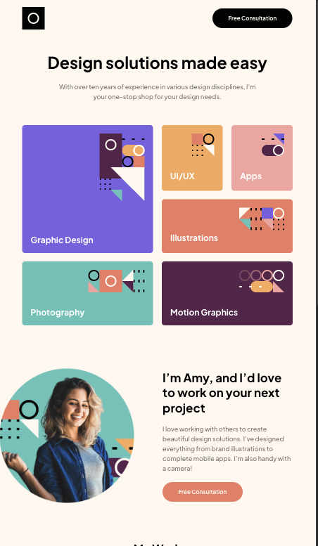

## Table of contents

- [Overview](#overview)
  - [The challenge](#the-challenge)
  - [Screenshot](#screenshot)
  - [Links](#links)
- [My process](#my-process)
  - [Built with](#built-with)
  - [What I learned](#what-i-learned)
  - [Continued development](#continued-development)
  - [Useful resources](#useful-resources)
- [Author](#author)

## Overview

### The challenge

Users should be able to:

- View the optimal layout for the site depending on their device's screen size
- See hover states for all interactive elements on the page
- Navigate the slider using either their mouse/trackpad or keyboard

### Screenshot

### Links

- Solution URL: [Github repo](https://github.com/mrcordova/single-page-design-portifolio)
- Live Site URL: [Github page](https://mrcordova.github.io/single-page-design-portifolio/)

## My process

### Built with

- Semantic HTML5 markup
- CSS custom properties
- Flexbox
- CSS Grid
- Mobile-first workflow

### What I learned

I learned how to make an image slider and how to use grid-template-area.

### Continued development

I want to learn more about making the image slider smoother.

### Useful resources

- [Hide scroll bar](https://stackoverflow.com/questions/16670931/hide-scroll-bar-but-while-still-being-able-to-scroll) - How to hide scroll bar while still being usable.
- [Max width for body](https://stackoverflow.com/questions/11088938/is-this-the-best-way-to-make-the-body-max-width-and-centered) - How to center entire project and center it.

## Author

- Website - [noahs.software](https://noahs.software)
- Frontend Mentor - [@mrcordova](https://www.frontendmentor.io/profile/mrcordova)
